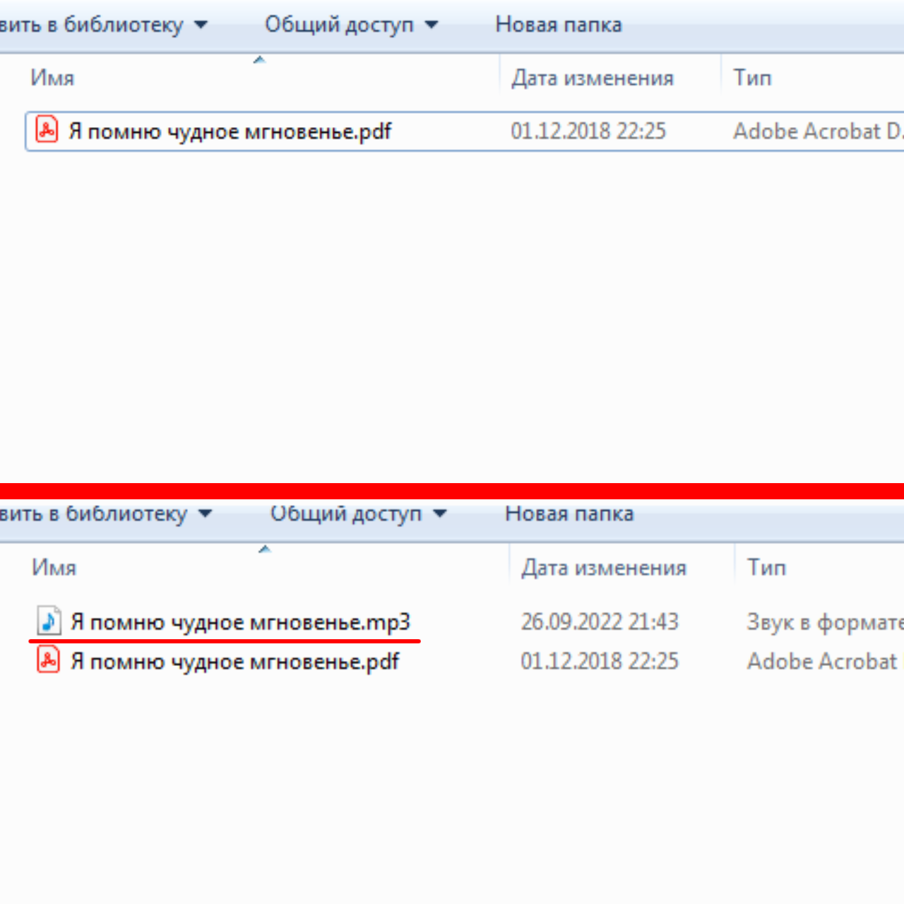

# PDF2mp3

PDF2mp3 - Это простой инструмент для конвертации PDf-файла в mp3
Пользователь добавляет нужный для конфертации файл в папку "docs/" проекта, указывает имя файла и его язык, а на выходе получает озвученный и записанный одноименный файл в этой же директории.

## Установка

1. Клонируйте репозиторий с GitHub
2. Добавьте в папку `docs/` PDF-файл, который собираетесь конвертировать.
3. Запустите скрипт через командную строку с помощью `python pdf2mp3.py`

## Работа с приложением

1. В строке `File name:` надо указать название PDF-файла, который вы добавили в `docs/`. Например: `example.pdf`.
2. В строке `File language` выбираем язык озвучки. Это либо русский (ru), либо английский (en)
3. После указания всех вышеперечисленных параметров, надо подождать. Время ожидания зависит от кол-ва текста в PDF-файле. В среднем ожидание занимает около 3-4 минут.